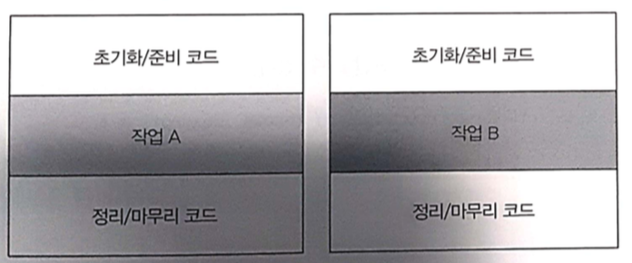
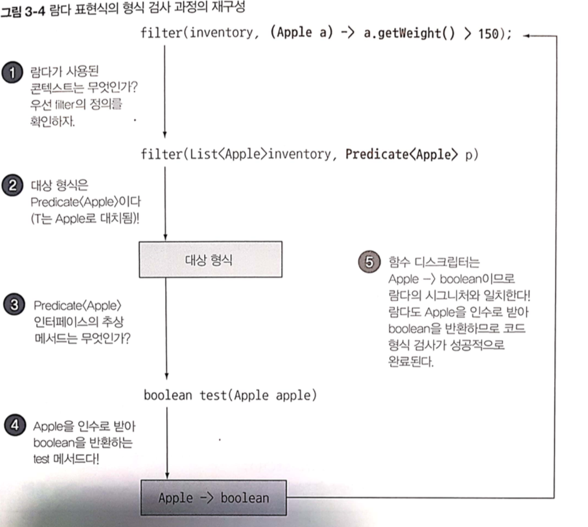
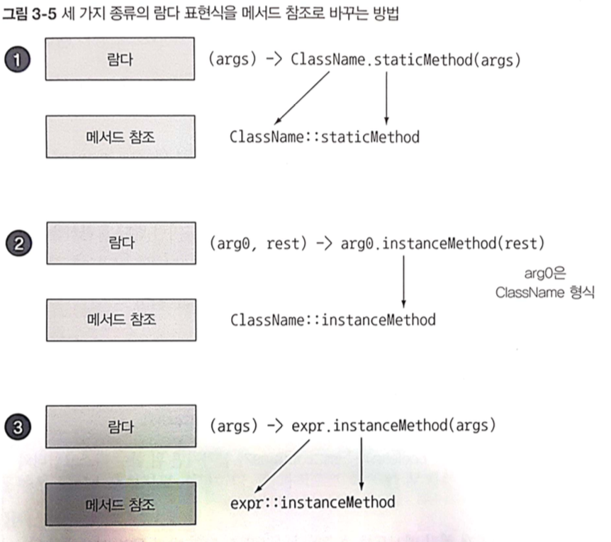

# chapter3

## 3.1 람다란 무엇인가?

람다 표현식은 메서드로 전달할 수 있는 익명 함수를 단순화 한것


`기존 코드와 람다식 함수의 비교`

``` java
Comparator<Apple> byWeight = new Comparator<Apple>(){

    public int compare(Apple a1 , Apple a2){
        return a1.getWeight().compareTo.(a2.getWeight());
    }

}


람다식을 이용한 코드

Comparator<Apple> byWeight = 
                (Apple a1 , Apple a2) -> a1.getWeight().compareTo.(a2.getWeight());

```

`람다식 표현식`

람다 파라미터
(Apple a1 , Apple a2)

람다 바디
a1.getWeight().compareTo.(a2.getWeight());


람다 바디는 람다의 반환값에 해당하는 표현식이다.


`람다 표현식 예제`

* 불리언 표현식 : (List<String> list) -> list.isEmpty()

* 객체 생성 : () -> new Apple(10)

* 객체에서 소비 : (Apple a) -> {
    System.out.println(a.getWeight());
}

* 객체에서 선택/추출 : (String s) -> s.length();

* 두 값을 조합 : (int a , int b) -> a * b

* 두 객체 비교 : (Apple a1 , Apple a2) -> a1.getWeight().compareTo.(a2.getWeight());

## 3.2.1힘수형 인터페이스란

함수형 인터페이스는 정확히 하나의 추상 메서드를 지정하는 인터페이스이다.

대표적인 함수형 인터페이스는 아래와 같다.


``` java
@FunctionalInterface
public interface Callable<V> {
    /**
     * Computes a result, or throws an exception if unable to do so.
     *
     * @return computed result
     * @throws Exception if unable to compute a result
     */
    V call() throws Exception;
}


@FunctionalInterface
public interface Runnable {
    /**
     * When an object implementing interface <code>Runnable</code> is used
     * to create a thread, starting the thread causes the object's
     * <code>run</code> method to be called in that separately executing
     * thread.
     * <p>
     * The general contract of the method <code>run</code> is that it may
     * take any action whatsoever.
     *
     * @see     java.lang.Thread#run()
     */
    public abstract void run();
}


@FunctionalInterface
public interface Comparator<T> {
    
    int compare(T o1, T o2);
}

```

* 람다 표현식으로 함수형 인터페이스의 추상 메서드 구현을 직접 전달할 수 있으므로 `전체 표현식을 함수형 인터페이스의 인스턴스로` 취급 할 수 있다.

이와 같은 기능을 하는게 익명 클래스이다.
(코드상으로 덜 깔끔하다는 단점이 존재)


``` java

public class LamdaTest02 {
    public static void main(String[] args) throws IOException {

        // 람다식 표현
        Runnable r1 = () -> System.out.println("hello world");

        Runnable r2 = new Runnable() {
            @Override
            public void run() {
                System.out.println("hello world 2");
            }
        };


        process(r1); // hello world
        process(r2); // hello world 2
    }

    public static void process(Runnable r){
        r.run();
    }
}
        
```


## 3.2.2 함수 디스크립터

람다 표현식의 시그니처를 서술하는 메서드를 함수 디스크립터라고 함 함수형 인터페이스의 추상 메서드 시크니처 ex\) Runnable 은 인수와 반환값이 없으므로 Runnable인터페이스는 인수와 반환값이 없는 시그니처다.

## 3.3 람다 활용 : 실행 어라운드 패턴

설정과 정리 두 과정이 둘러싸는 형태 ex\) 초기화/준비코드 - 작업 A - 정리/마무리 코드 초기화/준비코드 - 작업 B - 정리/마무리 코드




`processFile의 동작을 파라미터화 하기`


``` java

2단계 : 함수형 인터페이스를 이용해서 동작 전달
@FunctionalInterface
public interface BufferedReaderProcessor {
    String process(BufferedReader br) throws IOException;
}


public class LamdaTest{
    public static void main(String[] args) throws IOException {

        // 4단계 : 림다 전달
        String result = processFile02((BufferedReader br)->br.readLine()+br.readLine());


    }

    // 파일을 읽어오는 기본 소스
    public static String processFile01()throws IOException {
        try(BufferedReader br = new BufferedReader(new FileReader("data.txt"))){
            return br.readLine(); // 실제 필요한 작업을 하는 행이다.
        }
    }

    // 파라미터화 한다
    public static String processFile02(BufferedReaderProcessor p)throws IOException {
        try(BufferedReader br = new BufferedReader(new FileReader("data.txt"))){
            // 3단계 : 동작 실행
            return p.process(br);
        }
    }


}
        
```

## 3.4 함수형 인터페이스 사용

* 다양한 람다 표현식을 사용할면 공통의 함수 디스크립터를 기술하는 함수형 인터페이스 집합이 필요하다.

### 3.4.1 Predicate

* java.util.function.Predicate 인터페이스는 test 추상 메서드 정의
* test는 제네릭 형식 T객체를 받아 불리언 반환

```java
@FunctionalInterface
public interface Predicate<T> {
    boolean test(T t);
}

public <T> List<T> filter(List<T> list, Predicate<T> p) {
    List<T> results = new ArrayList<>();

    for(T t : list) {
        if (p.test(t)) {
            results.add(t);
        }
    }

    return results;
}

Predicate<String> nonEmptyStringPredicate = (String s) -> !s.isEmpty();
List<String> nonEmpty = filter(listOfStrings, nonEmptyStringPredicate);
```

### 3.4.2 Consumer

* java.util.function.Consumer 
* 제네릭 형식 T 객체를 받아서 void를 반환
* accepct 추상 메서드 정의
* T형식의 객체를 인수로 받아서 어떤 동작을 수행하고 싶을때

```java
@FunctionalInterface
public interface Consumer<T> {
    void accept(T t);
}

public <T> void forEach(List<T> list, Consumer<T> t) {
    for(T t : list) {
        c.appect(t);
    }
}

forEach(Arrays.asList(1, 2, 3, 4), (Integer i) -> System.out.println(i));
```

### 3.4.3 Function

* java.util.function.Function
* 제네릭 형식 T를 인수로 받음
* R객체를 반환하는 추상 메서드 apply정의

```java
@FunctionalInterface
public interface Function<T, R> {
    R apply(T t);
}

public <T, R> List<R> map(List<T> list, Function<T, R> f) {
    List<R> result = new ArrayList<>();

    for(T t : list) {
        result.add(f.apply(t));
    }

    return result;
}

List<Integer> l = map(Arrays,asList("lamda", "in"), (String s) -> s.length());
```

| 사용 사례 | 람다 예제 | 대응하는 함수 인터페이스 |
| :--- | :---: | ---: |
| 불리언 표현 | \(List list.isEmpty\(\) | Predicate&gt; |
| 객체 생성 | \(\) -&gt; new Apple\(10\) | Supplier |
| 객체에서 소비 | \(Apple a\) -&gt; System.out.println\(a.getWeight\(\) | Consumer |
| 객체에서 선택 추출 | \(String s\) -&gt; s.length\(\) | Function or ToIntFunction |
| 두 값 조합 | \(int a, int b\) -&gt; a \* b | IntBinaryOperator |
| 두 객체 비교 | \(Apple a1, Apple a2\) -&gt; a1.getWeght\(\).compareTo\(a2.getWeight\(\)\) | BiFunction or ToIntBiFunction |

## 3.5 형식 검사, 형식 추론, 제약

람다 표현식 자체에는 어떤 함수형 인터페이스를 구현하는지의 정보가 포함되어 있지 않다.
따라서 , 람다 표현식을 더 제대로 이해하려면 람다의 실제 형식을 파악해야 한다.


### 3.5.1 형식 검사

* 람다가 사용되는 콘텍스트를 이용해서 람다의 형식을 추론 가능
* 람다의 표현식의 형식을 대상 형식

람다 표현식을 사용할때 형식 확인 과정

``` java

List<Apple> heavierThan150g = 
                filter(inventory , (Apple a)->a.getWeight() > 150);

```

1. filter 메서드 선언 확인
2. filter 메서드는 두 번째 파라미터로 Predicate 형식\(대상 형식\)을 기대 
3. Predicate은 test라는 한 개의 추상 메서드를 정의한 함수형 인터페이스
4. test 메서드는 Apple을 받아 boolean을 반환하는 함수 디스크립터를 묘사
5. filter 매서드로 전달된 인수는 이와 같은 요구사항을 만족해야 한다.



### 3.5.2 형식 추론

대상 형식을 이용해 함수 디스크립터를 알 수 있으므로 컴파일러는 람다의 시그니처도 추론할수 있다.

`형식을 추론 하지 않는 경우`

``` java

Comparator<Apple> c = 
(Apple a1,Apple a2) -> a1.getWeight().compareTo(a2.getWeight());


```

`형식을 추론하는 경우`

``` java

Comparator<Apple> c = 
(a1,a2) -> a1.getWeight().compareTo(a2.getWeight());


```

### 3.5.4 지역 변수 사용

람다 캡쳐링

```java
int portNumber = 1337; //자동 final
Runnable r = () -> System.out.println(portNumber);
```

#### 지역 변수의 제약

왜 지역 변수에 이런 제약이 필요하냐면 말이다?

* 인스턴스 변수는 어디에 저장되냐 힙에 저장된다 이거야
* 지역 변수는 어디에 저장되냐 하면 스택에 저장 된다 이거야
* 람다에서 지역 변수에 바로 접근 할수 있다 치자 이거야 람다가 스레드에서 실행된다면  지역 변수를 할당한 스레드가 사라져버리면 우짤거냐 이그야
* 그래서 자바에서는 지역 변수의 복사본을 제공한다 이그야 

#### 클로저

* 클로저란 함수의 비지역 변수를 자유롭게 참조할 수 있는 함수의 인스턴스를 가리킨다.

## 3.6 메소드 참조

### 3.6.1 요약

* 특정 메소드만 호출하는 람다의 축약형
* 가독성을 높임

### 메소드 참조를 만드는 법

1. 정적 메소드 참조
   * ex\) Integer의 parseInt -&gt; Integer::parseInt 
2. 다양한 형식의 인스턴스 메서드 참조
   * ex\) String 의 length -&gt; String::length
3. 기존 객체의 인스턴스 메서드 참조
   * ex\) Transaction expensiveTransaction = new Transaction\(\) -&gt; expensiveTransaction::getValue




### 생성자 참조

클래스의 생성자를 이용하는 방법

예를 들어, 인수 없는 생성자, Supplier의 () -> Apple과 같은 시그니처를 갖는 생성자가 있다고 가정하자.

Supplier<Apple> c1 = Apple::new;
Apple a1 = c1.get(); // Supplier의 get 메서드를 호출해서 새로운 Apple 객체를 만들 수 있다.


`위에 예제의 람다식 표현`

Supplier<Apple> c1 = () -> new Apple();
Apple a1 = c1.get(); // Supplier의 get 메서드를 호출해서 새로운 Apple 객체를 만들 수 있다.


Apple(Integer weight) 라는 시그니처를 갖는 생성자는 Function 인터페이스의 시그니처와 같다.
따라서 다음과 같은 코드르 구현할 수 있다.


``` java

Function<Integer , Apple> c2 = new Apple:new;
Apple a2 = c2.apply(110);  // Function의 apply 메서드의 무게를 인수로 호출하여 새로운 Apple 객체를 만들수 있다.


// 람다식 표현

Function<Integer , Apple> c2 = (weight) -> new Apple(weight);
Apple a2 = c2.apply(110);


```


### 람다 , 메서드 참조 활용하기

#### 1단계:코드 전달

``` java

static class AppleComparator implements Comparator<Apple> {

        @Override
        public int compare(Apple a1, Apple a2) {
            return a1.getWeight() - a2.getWeight();
        }
    }

```

#### 2단계:익명 클래스 사용


``` java

inventory.sort(new Comparator<Apple>() {
            @Override
            public int compare(Apple a1, Apple a2) {
                return a1.getWeight() - a2.getWeight();
            }
        });

```

#### 3단계:람다표현식 사용

``` java

inventory.sort((Apple a1, Apple a2)-> a1.getWeight() - a2.getWeight());

// 자바 컴파일러는 람다 표현식에 사용된 콘텍스트를 활용해서 람다의 파라미터 형식을 추론할 수 있어 아래와 같이 코드를 사용할 수 있다.
inventory.sort((a1, a2)-> a1.getWeight() - a2.getWeight());

```


#### 4단계:메서드 참조 이용

``` java

inventory.sort(comparing(Apple::getWeight)); 

```


## 3.8 람다 표현식을 조합할 수 있는 유용한 메서드

### Comparator조합

Comparator.comparing을 이용해서 비교에 사용할 키를 추출 Comparator 의 comparing은 디폴트 메서

```java
Comparator<Apple> c = Comparator.comparing(Apple::getWeight);
```

#### 역정렬

Comparator 에서 reverse 디폴트 메소드를 제공

```java
inventory.sort(comparing(Apple::getWeight).reversed());
```


#### thenComparing

* 소팅할때 비교할 값이 같을때 두 번째 비교자를 사용할 수 있다.

  ```java
  inventory.sort(comparing(Apple::getWeight).reversed().tehComparing(Apple::getCountry)); //두 사과의 무게가 같으면 국가별로 정렬
  ```

  **Predicate조합**

  * negate, and, or 메서드 제공 
  * negate : 기존 프리디케이트 객체를 반전
  * and : 두 프리디케이트를 연결 새로운 프리디케이트 객체 만듬
  * or : 프리디 케이트를 연결해서 더 복잡한 프리디케이트 객체를 만듬

### Function 조합

* andThen과 compose 두 가지 디폴트 메서드 제공

#### andThen 조합

* 숫자를 증가\(x -&gt; x + 1\) 시키는 f 함수
* 숫자에 2를 곱하는 g함수
* f와 g를 조립해서 숫자를 증가 시킨뒤 결과에 2를 곱한

```java
Function<Integer, Integer> f = x -> x + 1;
Function<Integer, Integer> g = x -> x * 2;
Function<Integer, Integer> h = f.andThen(g);
int result = h.apply(1);  //4
```

#### compose

* 인수로 주어진 함수를 먼저 실행한 다음 결과를 외부 함수 인수로 제공
* 즉 andThen\(g\) = g\(f\(x\)\) 지만 compose는 f\(g\(x\)\)된다

```java
Function<Integer, Integer> f = x -> x + 1;
Function<Integer, Integer> g = x -> x * 2;
Function<Integer, Integer> h = f.compose(g);
int result = h.apply(1);  //3을 반환
```
